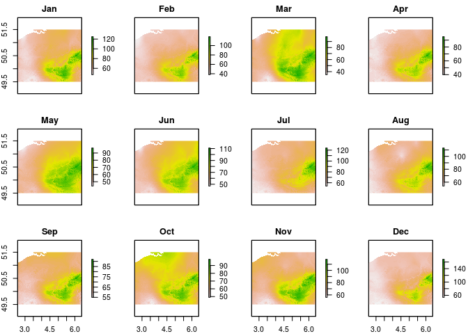
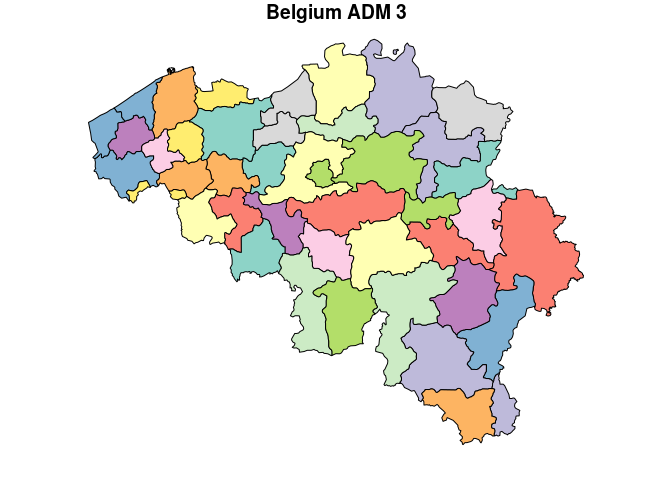
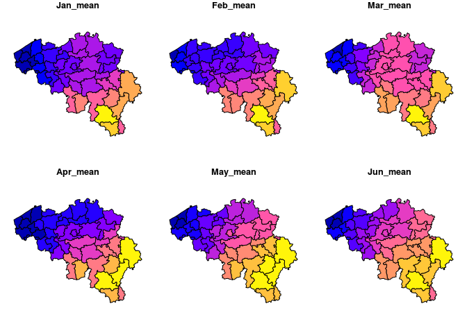

<!-- README.md is generated from README.Rmd. Please edit that file -->

# Gurugis - the way of GISdom 

<!-- badges: start -->

[](https://www.tidyverse.org/lifecycle/#experimental)
<!-- badges: end -->

The goal of gurugis is to provide a series of functions useful to the
regular GIS spatial analysis workflow.

## Installation

You can install the development version from
[GitHub](https://github.com/) with:

``` r
# install.packages("devtools")
devtools::install_github("damienjacques/gurugis")
```

## Example

This is a basic example which shows you how to make quick zonal
statistics from a raster and a vector layer defining the areas:

``` r
library(gurugis)
library(raster)
#> Loading required package: sp
library(sf)
#> Linking to GEOS 3.5.1, GDAL 2.2.2, PROJ 4.9.2

# raster file for which I want to compute zonal statistics
plot(precipitation)
```



``` r

# vector layer with the zones
plot(belgium[10], main = "Belgium ADM 3")
```



``` r

# compute average of precipiation in each zone
output <- zonal_pipe(precipitation, belgium, stats = "mean")

# plot 6 first months
plot(output[18:23])
```


